<a href="https://nandakishorer.vercel.app">
  
</a>

<p align="center">
  <a href="https://nandakishorer.vercel.app"></a>
  <a href="https://www.linkedin.com/in/nanda-kishore-7290551b8/"></a>
  <a href="mailto:r.nandakishore24@gmail.com"></a>
  <a href="https://nandakishorer.vercel.app/Nanda_Kishore_Resume.pdf"></a>
</p>

```console
$ curl -s https://nandakishorer.vercel.app/api/whoami | jq
```

```json
{
  "name": "Nanda Kishore R",
  "role": "Software Engineer, Backend",
  "stack": ["Java 17", "Spring Boot", "PostgreSQL", "Python / FastAPI"],
  "focus": ["concurrency", "multi-tenancy", "transactions"],
  "location": "Chennai, IN",
  "open_to_work": true
}
```

## `GET /about`

Software engineer with one year of full-time onsite experience on a multi-tenant healthcare platform, working across REST APIs and the PostgreSQL data layer: concurrency control, row-level authorization and transactional integrity. I build backend services in **Java 17 / Spring Boot** and **Python / FastAPI**.

## `GET /experience`

**Software Developer Intern · Botcode (HealthPilot.ai)** · Chennai · Aug 2025 – Aug 2026 · full-time, onsite

That code lives in the company's GitHub organization, so here is the work in words:

- Built core modules of a multi-tenant clinic platform that serves multiple hospitals from one PostgreSQL schema: role-based access control, scheduling, clinical charting and billing. I'm the largest contributor to its prescription-pad module (56% of the current code).
- Closed a duplicate-record race in clinical chart saves by moving the invariant into PostgreSQL: a partial unique index plus an `ON CONFLICT` upsert inside one stored procedure, with an idempotent backfill for tenants that already held duplicates.
- Hardened an AI clinical-recommendations feature before release. I fixed a row-level-security policy that never verified patient ownership, scoped reads to the authoring clinician, enforced organization and role checks on writes, and made a read-modify-write settings update atomic. That added 40 tests, including a concurrency regression.
- Retired a legacy workflow engine (116 files and 45 API routes), dropping 9 tables and 9 functions in one transactional migration, and documented 150 defects and the safe-deletion rules in an architecture decision record.

<sub>~650 commits · 138 automated test cases · 7 architecture decision records in 12 months</sub>

## `GET /projects`

<table>
  <tr>
    <td width="50%" valign="top">
      <h3><a href="https://github.com/NandaKishore2424/SkillBridgeV2">SkillBridge</a></h3>
      <sub>Multi-tenant training-management API</sub>
      <p>Colleges run placement-training batches for admins, trainers and students, with every college isolated inside one shared schema.</p>
      <ul>
        <li>20 REST controllers, 122 endpoints, 26 JPA entities, and four-role access control through 113 method-level <code>@PreAuthorize</code> rules</li>
        <li>Shared-schema tenant isolation: a Hibernate filter plus a 404-not-403 ownership guard</li>
        <li>Transactional outbox to RabbitMQ with a <code>SKIP LOCKED</code> relay, publisher confirms and a dead-letter store. Tested by killing a real broker for five minutes: all 601 events were delivered, none went dead.</li>
        <li>Removed three N+1 query patterns, with a test that fails if a read path's SQL statement count grows with data size</li>
      </ul>
      <p></p>
      <p><a href="https://nandakishorer.vercel.app/projects/skillbridge"><b>Case study →</b></a> · <a href="https://github.com/NandaKishore2424/SkillBridgeV2">Source</a></p>
    </td>
    <td width="50%" valign="top">
      <h3><a href="https://github.com/NandaKishore2424/integronix">Integronix</a></h3>
      <sub>Agentic revenue-audit pipeline for medical coding</sub>
      <p>Turns clinical notes into ICD-10-CM and CPT billing suggestions for a person to review. The LLM makes one extraction call; deterministic code makes every billing decision.</p>
      <ul>
        <li>10-node LangGraph pipeline on FastAPI, with pgvector retrieval only as a fallback</li>
        <li>A 1,025-line deterministic decision engine (41% of the pipeline); fixed an upcoding defect where longer, rarer codes outranked better-documented ones</li>
        <li>Claim adjudication moved into one PostgreSQL function with an optimistic lock: when two approvals race, one succeeds and one gets 409 Conflict. Money is Decimal, quantized to the cent.</li>
        <li>359 tests, including a schema-contract test against the real database</li>
      </ul>
      <p></p>
      <p><a href="https://nandakishorer.vercel.app/projects/integronix"><b>Case study →</b></a> · <a href="https://github.com/NandaKishore2424/integronix">Source</a></p>
    </td>
  </tr>
</table>

## `GET /stack`

<p>
  
</p>

| Layer | What I use |
|---|---|
| **Build** | Java 17 · Spring Boot · Spring Security · JPA / Hibernate · REST APIs · JWT · Python · FastAPI |
| **Data & messaging** | PostgreSQL · RabbitMQ · Flyway · pgvector |
| **Prove** | JUnit · Mockito · Testcontainers · ArchUnit · pytest |
| **Ship** | Docker · AWS (EC2) · GitHub Actions · CI/CD · Git · Agile / Scrum (Linear) · code review |
| **Concepts** | object-oriented design · design patterns · multi-tenancy · concurrency · transactions · indexing · LangGraph · RAG · vector search |

## `GET /education`

**BE, Electronics and Communication Engineering** · Saveetha Engineering College · 2022 – 2026 · CGPA 8.98 / 10

- Published an IEEE conference paper on [lightweight deep learning for white blood cell counting](https://ieeexplore.ieee.org/document/11497191)
- Winner, Hardware Track, AMD Pervasive AI Developer Challenge · finalist, Virtusa hackathon
- GeeksforGeeks Campus Ambassador · symposium coordinator (10+ workshops for 300+ students)
- Certifications: Programming in Java (NPTEL, IIT Kharagpur) · AWS Cloud Solutions Architect (Coursera) · Efficient LLM Customization (NVIDIA)

## `GET /activity`

<picture>
  <source media="(prefers-color-scheme: dark)" srcset="https://raw.githubusercontent.com/NandaKishore2424/NandaKishore2424/output/github-snake-dark.svg" />
  <source media="(prefers-color-scheme: light)" srcset="https://raw.githubusercontent.com/NandaKishore2424/NandaKishore2424/output/github-snake.svg" />
  
</picture>

## `POST /contact`

Hiring for a backend role, or want to talk about Spring Boot, PostgreSQL or messaging? Email [r.nandakishore24@gmail.com](mailto:r.nandakishore24@gmail.com), message me on [LinkedIn](https://www.linkedin.com/in/nanda-kishore-7290551b8/), or use the form on [my portfolio](https://nandakishorer.vercel.app/#contact).

<sub>HTTP/1.1 200 OK · connection: keep-alive</sub>
